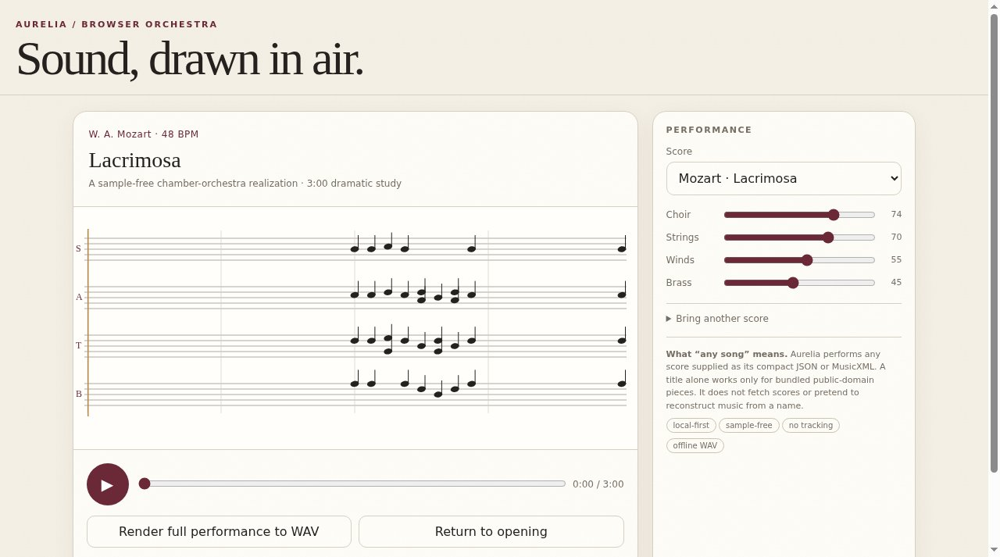

# Aurelia

A sample-free browser orchestra with a live score and offline WAV rendering.



**Live:** https://aeiouvcode.github.io/aurelia/

## About

Aurelia synthesizes every voice in the page: strings, winds, brass, choir and room reflections. There is no MIDI playback and there are no recordings. Pick a bundled public-domain work (Mozart's Lacrimosa, Bach's Prelude in C, Beethoven's Ode to Joy), balance the sections, follow the notation as it plays, and render the full performance to a WAV file offline.

Other music can be loaded as MusicXML or as Aurelia's compact JSON format. A title alone only works for the bundled pieces; Aurelia does not fetch or guess scores.

## Built with

Web Audio API synthesis and offline rendering, in a single `index.html`. No samples, no tracking, no network calls.

## Run locally

```sh
git clone https://github.com/aeiouvcode/aurelia.git
cd aurelia
python3 -m http.server 8000
```

Then open http://localhost:8000.
